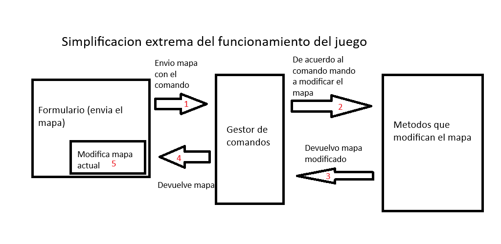
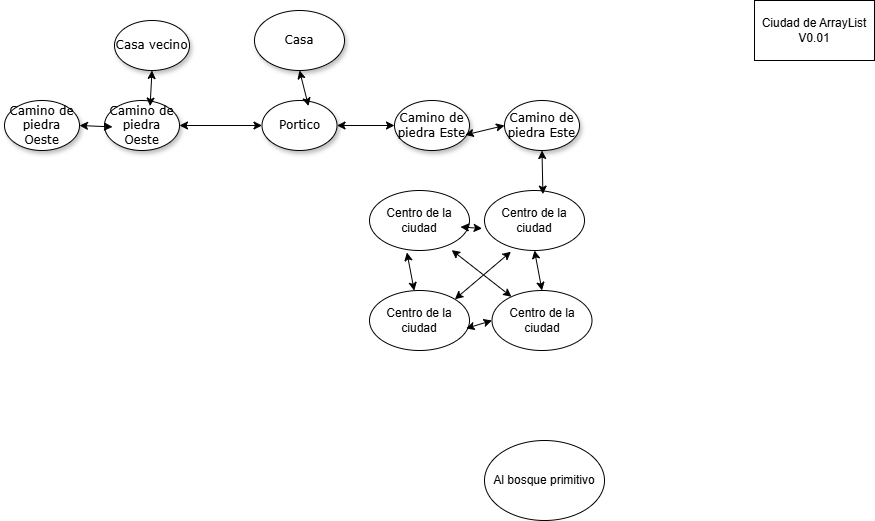

# JAVA QUEST

## Sobre el proyecto
JavaQuest es un videojuego estilo aventura de texto creado por Pablo Soifer (Draculinio), para poder aprender Java mientras hace un proyecto.

Para obligarme a hacer este proyecto me puse a streamear casi a diario en Twitch y subo los videos luego a youtube.

* Twitch: https://www.twitch.tv/draculinio
* Youtube: https://www.youtube.com/@DraculinioAprende

La idea es también en lo posible usar solo Java (para el manejo de librerias uso Gradle) y tratar de exprimir y aprender todo lo posible de el.

## Consideraciones de arquitectura

### Reglas de codigo
* Puedo usar inteligencia artificial, pero solo como apoyo, para aprender nuevos conceptos o como funciona una libreria, nunca dejarme guiar ciegamente por la misma.
* El juego no tiene un rumbo fijo, pero sí una idea de lo que va a ser por lo que los refactor pueden ser comunes.

### Librerias usadas en el juego

* JavaFX
* Lombok

###  Arquitectura general del juego

## Sobre el mundo de Java

## Comandos implementados:

* atacar [enemigo]
* salidas
* ir [lugar]

## Consideraciones finales
Sera esto un juego real y comercial en el futuro? Solo D-s sabe.